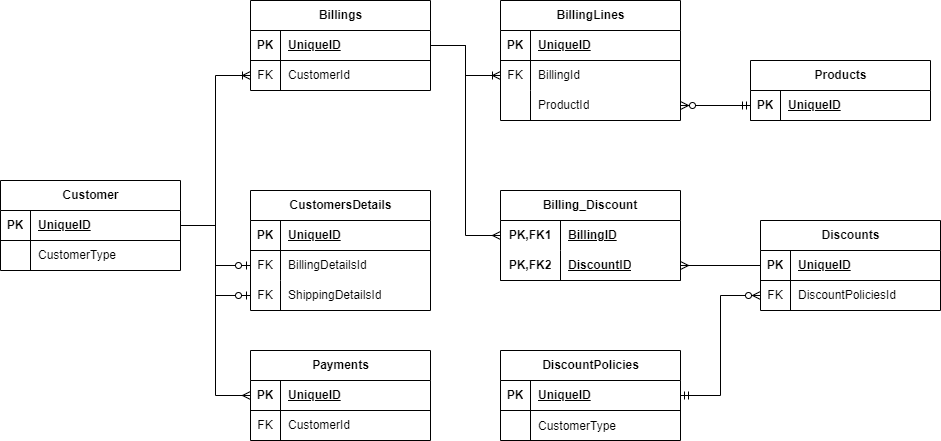

# MyApp
MyApp est un template d'application web déployé sur un cluster Kubernetes (k8s) qui a pour but de gérer des clients d'entreprise.

## Installation (Windows)

- Installer et lancer [Docker desktop](https://www.docker.com/products/docker-desktop/):    
  Veuillez activer k8s dans les options de Docker Desktop (Settings > Kubernetes > Enable Kubernetes)

  Faire de Docker votre cluster k8s local:
 ```properties
  kubectl config use-context docker-desktop
 ```
- Installer [Tilt](https://docs.tilt.dev/install.html):
  ```properties
  iex ((new-object net.webclient).DownloadString('https://raw.githubusercontent.com/tilt-dev/tilt/master/scripts/install.ps1'))
 ```
## Utilisation

### Lancement
- Ouvrir un terminal à la racine du projet

- Lancer Tilt:
```properties  
tilt up  
```  
Un utilitaire de visualisation se lance avec Tilt, une fois le build fini, l'application sera disponible sur http://localhost:3000/
### Arrêt
```properties  
tilt down  
```  
## Structure
Base de donnée:



## Contributing

Pull requests are welcome. For major changes, please open an issue first  
to discuss what you would like to change.

Please make sure to update tests as appropriate.

## License

[MIT](https://choosealicense.com/licenses/mit/)
